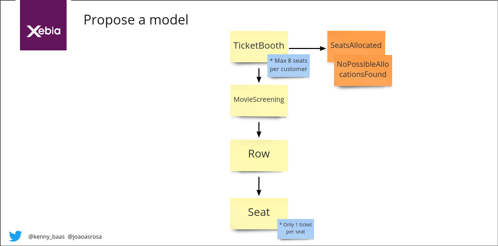
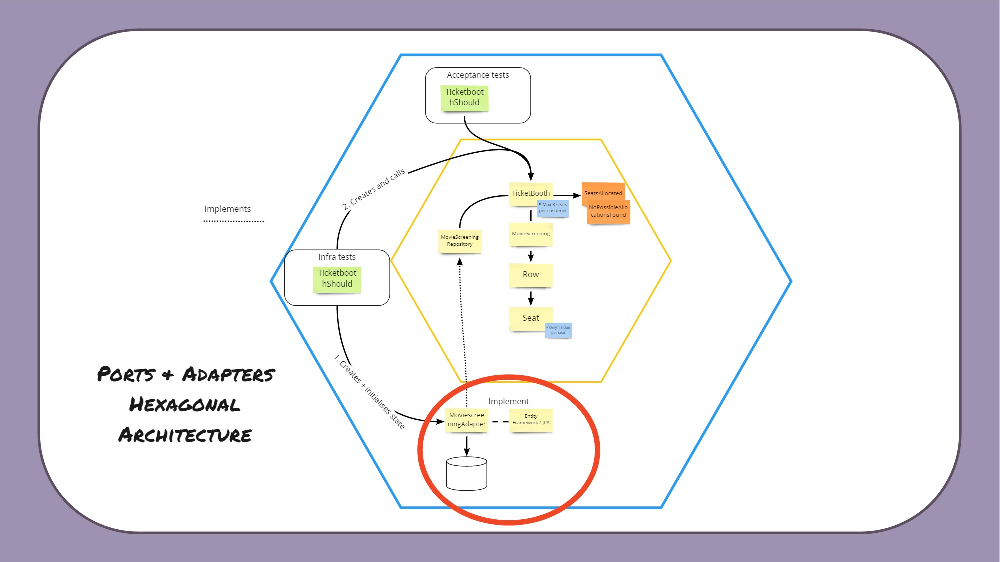
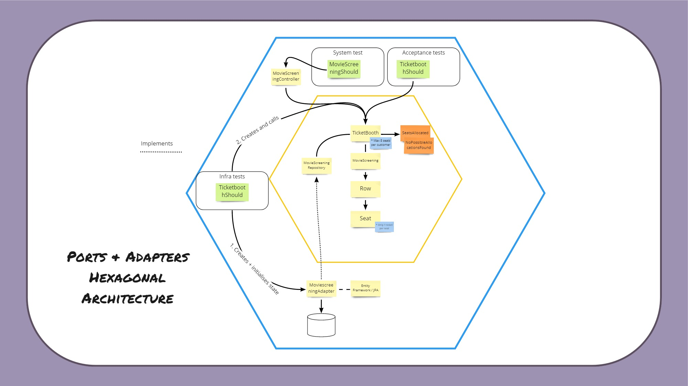

# Cinema allocations bounded context workshop

## Requirements

### Java

Java 8 or higher
Maven
Lombok plugin

### C#

.Net Core 3.1

## Exercise

### Lab 1

Start on main branch by implementing the tests `TicketBoothShould` by doing outside-in TDD. We already setup most scaffolding with an aenemic Domain Model to help you. You can find the stubs for the MovieScreening state at `Stubs/`. In Stubs you can create your own examples by following the json schema that is already there. It all comes down to the `showId` that is being used in the tests.

We use the following naive first design of our model to implement with outside-in TDD:

the result can be find at lab1end

### lab 2

We have added two more test to `TicketBoothShould` for you to implement. In this lab you will focus on implementing the adjacent seating rule. We have added a new Stub for you to use which you can checkout in `/Stubs/README.MD`. The model has not changed!

The result can be found in lab2end

### lab 3 - Ports & Adapters / Hexagonal architecture

In lab 3 you will start implementing the ORM side of the Hexagonal by implementing the MovieScreeningAdapter and reuse the same TicketBoothShould test, but now against an in memory database instead of a stub. We have added the a seperate project that contains the infra part. It is your job to make the TicketBootShould in the infra test pass and not change anything to your domain code. It does however require you to adjust both test code and infra side code.

#### Java

In java we make use of spring boot to start our instance and test against TicketBooth with h2 as an in-memory database. You can find all the code you need in `CinemaAllocationsInfra` and specificly for this lab un der `repository`. Spring boot is already setup and ready to go!

#### C# 

In C# you can find the code under `CinemaAllocations.Infra.DataPersistence` and `CinemaAllocations.Tests.Integration`. EntityFramework is already setup in the tests.

### Lab 4 - Ports & Adapters / Hexagonal architecture

In lab 3 you will start implementing the Rest controller side of the Hexagonal by implementing the MovieScreeningController and reuse the same tests from TicketBoothShould test, but now against run against a rest endpoint. You run the test with an in-memory database. It is your job to make the MovieScreeningShould test work.

### Bonus

In case you have not run into it yet there are two major bugs in the current state of the software. Perhaps you already solved or figured it out yourselve which is perfect! As a bonus you can start working on solving the bugs

#### No moviescreening found

In the tests we have not covered that we cannot find a MovieScreening. As from a business perspective this should not be able to happen, but as you probably know it CAN happen. This is why the different perceptions come in during modelling to catch these bugs. Write a test code that checks if a moviescreening found en think about what to return in that case. Start with in domain side and work your way up to the outside system test.

#### Saving the new state

At this moment the ticketbooth returns SeatsAllocated when the MovieScreening allocated new seats, but it never saves it while the tests still succeed. What you want to check during the tests is that the state is saved. Add this check to the tests and implement the state save.